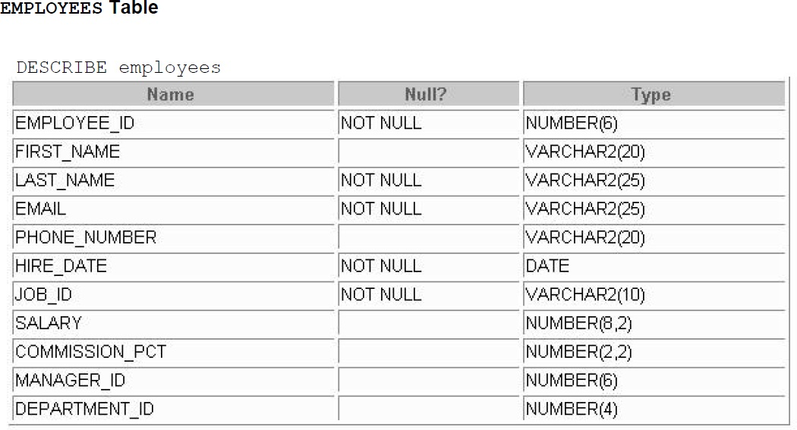
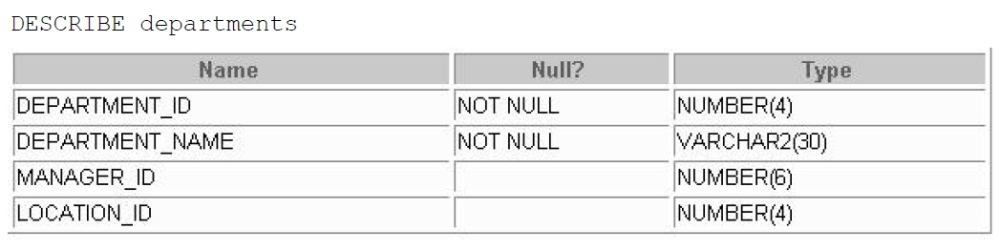

### LAB-Week 01(Part A)
**Activity 01:**
Write SQL statement for create the 'Employees' table:

~~~~SQL
CREATE TABLE employees (
    EMPLOYEE_ID int(6) PRIMARY KEY AUTO_INCREMENT,
    FIRST_NAME varchar(20),
    LAST_NAME varchar(25) NOT NULL,
    EMAIL varchar(25) NOT NULL,
    PHONE_NUMBER varchar(20),
    HIRE_DATE date NOT NULL,
    JOB_ID varchar(10) NOT NULL,
    SALARY decimal(8,2),
    COMMISSION_PCT decimal(2,2),
    MANAGER_ID int(6),
    DEPTARTMENT_ID int(4)
)
~~~~
### LAB-Week 01(Part B)
**Activity 01:**
Write SQL statement for create the 'Departments' table:

~~~~SQL
CREATE TABLE DEPARTMENTS (
  DEPARTMENT_ID int(4) PRIMARY KEY AUTO_INCREMENT,
  NAME varchar(30) NOT NULL,
  MANAGER_ID int(6),
  LOCATION_ID int(4)
)
~~~~
**Activity 02:**
Write SQL statement for INSERT two employees' data into the employees table you create earlier.

~~~~SQL
INSERT INTO EMPLOYEES (EMPLOYEE_ID, FIRST_NAME, LAST_NAME,EMAIL,PHONE_NUMBER, HIRE_DATE, JOB_ID, SALARY, COMMISSION_PCT, MANAGER_ID, DEPTARTMENT_ID) VALUES
  (100, 'Steven', 'King', 'SKING', '515.123.4567', '2006-06-17', 'AD_PRES', '24000.00', NULL, NULL, 90),
  (101, 'Neena', 'Kochar', 'NKOCHAR', '515.123.4568', '2008-09-21', 'AD_VP', '17000.00', NULL, 100, 90)
~~~~
**Activity 03:**
Write SQL statement for INSERT two Departments' data into the Departments table you just created.

~~~~SQL
INSERT INTO DEPARTMENTS (DEPARTMENT_ID, NAME, MANAGER_ID, LOCATION_ID) VALUES
  (10, 'Administration', 200, 1700),
  (20, 'Marketing', 201, 1800)
~~~~
