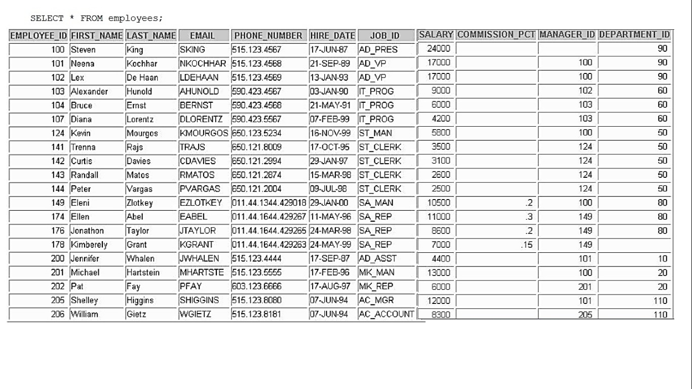

### LAB-Week 03 (Part A)
**Activity 01:**
Display the employee last name, job ID, and start date of employees hired between February 20, 1998, and May 1, 1998. Order the query in ascending order by start date.

~~~~SQL
SELECT LAST_NAME, JOB_ID, HIRE_DATE
FROM EMPLOYEES
WHERE HIRE_DATE BETWEEN '1998-02-02' AND '1998-05-01'
~~~~

**Activity 02:**
Display the last name and department number of all employees in departments 20 and 50 in alphabetical order by name.
~~~~SQL
SELECT LAST_NAME, DEPTARTMENT_ID
FROM EMPLOYEES
WHERE DEPTARTMENT_ID IN (20,50)
ORDER BY LAST_NAME
~~~~
### LAB-Week 03 (Part B)

**Activity 01:**
Display the last name and hire date of every employee who was hired in 1994.

~~~~SQL
SELECT LAST_NAME, HIRE_DATE
FROM EMPLOYEES
WHERE HIRE_DATE like '1994-__-__'
~~~~

**Activity 02:**
Display the last name, salary, and commission for all employees who earn commissions. Sort data in descending order of salary and commissions.

~~~~SQL
SELECT LAST_NAME, SALARY, COMMISSION_PCT
FROM EMPLOYEES
WHERE COMMISSION_PCT IS NOT NULL
ORDER BY SALARY,COMMISSION_PCT DESC
~~~~

**Activity 03:**
Display the last name of all employees who have an a and an e in their last name.

~~~~SQL
SELECT LAST_NAME
FROM EMPLOYEES
WHERE LAST_NAME LIKE '%a%' and '%e%';
~~~~
